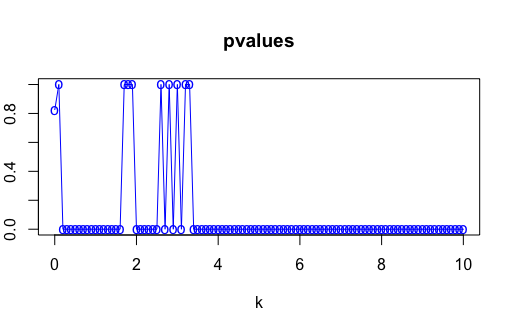
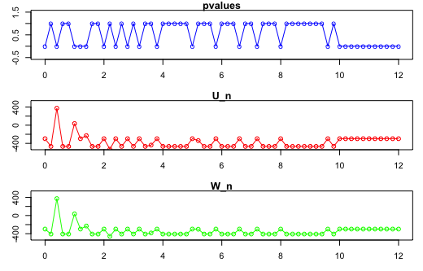

### PART1
We managed to install the package from github.

### Part 2

We have a sampling of $n$ independent observation from a Gaussian *joint* distribution of dimension $p$. These data are stored into a matrix $\mathbb{X} \in \mathbb{R}^{n\times p}$.<br>

Given the matrix we want to get more clues about the unknown adjacency matrix that models the DAG of the joint distribution that has generated our observations.

This matrix is $\mathbb{A}$ and it's a lower triangular matrix that belongs to $\mathbb{R}^{p\times p}$, and it's such that it has a 0 in the position $(i,j)$ if $j \not\in pa(X_i)$, else the value represents the strength of the relationship that involves the two nodes.<br>

We know how to model our observation, we know what $\mathbb{A}$ means, but how can we link the distribution of the j-th random variable (remember that we have a p-dimensional random vector) to the matrix $\mathbb{A}$?<br>
Well, we can say that the j-th random variable $X_j$ can be computed as follows:
\begin{equation}
  X_j = \sum_{k | k \neq j}\mathbb{A[j,k]\cdot X_k}+\epsilon_j
\end{equation}
The Gaussianity is in $\epsilon$, in fact $\epsilon_j \sim N_1(0, \sigma^2)$.

So, we have a model that depends from two parameters that are $\mathbb{A}$ and $\sigma^2$. At this point we can proceed to the things that are of interest .

Since we can obtain the distributions of the X from our parameters, we want to discover our parameters starting from our observations, so the problem is reduced to finding $\theta = (\mathbb{A}, \sigma^2)$ starting from $\mathbb{X}$.

In order to do this we can use the log likelihood that's defined as follows:
\begin{equation}
  \mathcal{\ell}_n(\mathbb{A}, \sigma^2) \propto - \sum_{j=1}^p \left (\frac{1}{2\sigma^2} \sum_{i=1}^n \left( \mathbb{X}[i,j] - \sum_{k | k\neq j} \mathbb{A}[j,k]\cdot \mathbb{X}[i,k]\right)^2 + \frac{n}{2}ln\sigma^2 \right)
\end{equation}
Let's analyze it:
We have three sums that are, going from the inner to the outer:

* **inner**: $\sum_{k \in [1,p] \setminus j} \mathbb{A}[j,k]\cdot \mathbb{X}[i,k]$ where we are computing the dot product from the weight that has the eventual edge that goes from $k$ to $j$ (scalar) and the value of the k-th random variable ($X_k$) in the i-th sample, and then summing all these values. This can be seen as a kind of weighted sum of the i-th sample where the weights are the influences that all the other random variables have over the j-th one, and as such it can be seen as :"    how much is j influenced by the other variables in the sample $i$?"
* **middle**: $\sum_{i=1}^n \left( \mathbb{X}[i,j] - \text{inner}\right )^2$ where for each of the i-th observation of the j-th random variable, we subtract the sum obtained in the inner that is a scalar, then summing all these values. We are subtracting the value of the j-th random variable in the sample i with the value computed above, so we can interpret it as 'how much j is distant from the value that should have accordingly with the other variables', then we compute the square of this difference. It can be interpreted as the euclidean distance from the vector of the n samples of j and the vector of the N values that j should assume given the other R.Vs .
* **outer**: $-\sum_{j=1}^p \frac{\text{middle}}{2\sigma^2} + \frac{n}{2}ln\sigma^2$ We sums up the value obtained from all the $p$ random variables multiplied and summed with constants that are dependent from $\sigma^2$

Let's see it in code:


```{r}
library(clrdag)

compute.middle = function(X, A, j, p){
  # Finding the indexes K = {k s.t. k is in [1,p]\j}
    K = which((1:p)!=j)
    # in k we have the indexes of the row without j
    
    inners = apply(X[, K] * A[j, K], 1, sum) # n length vector containing the inner sums for each i-th sample
    middle = sum((X[, j] - inners)^2)  # as a matter of fact in the middle we are working on the j-th column
    return(middle)
}

log_likelihood = function(X, A, sigma.square){
  n = dim(X)[1]
  p = dim(X)[2]
  return(-sum(sapply(1:p, function(j) (compute.middle(X,A,j,p)/(2*sigma.square)+(n/2*log(sigma.square))))))
}

```


Since MLEdag computes for us the estimate of the matrix $\mathbb{A}$ and the matrix $\mathbb{X}$ is what we have, given that it's our observation, we can optimize the log likelihood in order to retrieve sigma, so it'll be the sigma.MLE

```{r}
sigma.MLE = function(X, A)
  return(
    optim(
      par=c(0.01),
      fn=function(sigma.sq)
        log_likelihood(X,A, sigma.sq),
      method=c("Brent"),
      lower = 0,
      upper = 10000,
            control = list(fnscale = -1)
    )
  )
```

According with [Chunlin Li Et. al](https://elearning.uniroma1.it/pluginfile.php/1112893/mod_assign/introattachment/0/Likelihood%20Ratio%20Tests%20for%20a%20Large%20Directed%20Acyclic%20Graph.pdf?forcedownload=1) we can also aproximate $\sigma^2$ with:
\begin{equation}
  \hat{\sigma}^2 = (np)^{-1} \sum_{j=1}^p \sum_{i=1}^n\left ( \mathbb{X}[i,j] - \sum_{k | k\neq j} \mathbb{A}[j,k]\cdot \mathbb{X}[i,k] \right ) ^2
\end{equation}

In code we have:

```{r}
sigma.estimator = function(X, A){
  n = dim(X)[1]
  p = dim(X)[2]
  return(sum(sapply(1:p, function(j)compute.middle(X,A,j, p)))/(n*p))
}

```

### Constrained Likelihood Ratio Test
Since we can now approximate sigma and $\mathbb{A}$ starting from $\mathbb{X}$, we are able to run a constrained likelihood ratio test, in order to test the existence of directed links between specific nodes or directed pathways.<br>
The choice to reject the $H_0$ hypothesis in the two tests are made based on one of these two values:

* $U_n$ for the **split** likelihood ratio
* $W_n$ for the **cross-fit** likelihood ratio

The main idea behind the computation of these two metrics is that when we want the **constrained version** of $\mathbb{A}$ we'll pass into the ```MLEdag``` function the observation matrix, a matrix $D$ that is the matrix representation of the set of linkages $F$ and is such that has 1 only in the coordinates $(i, j) \in F$ and some other numerical parameters. We'll compute over the entire observation the estimate of $\mathbb{A}$ with this function and we'll take the A.H0 result for the constrained version, and A.H1 for the unconstrained one.<br>
Once we have the $\mathbb{A}$ matrices, it's trivial to find the estimates for the $\sigma^2$ simply by using the function ```sigma.estimator``` described above. In this specific case we'll compute these estimates over the training part of $\mathbb{X}$ for the **constrained version** and over the test part for the other one.<br>
At this point we have $\hat{\theta}_0^{tr}$ and $\hat{\theta}^{te}$ to compute the $U_n$ value and, consequently, the $W_n$, but in both cases we'll use their *logarithmic version*.


We want to highlight that for the pathway test we also need to compute not only the $\theta$ that maximizes the likelihood but also we need to find the right value of sparsity that maximizes it, so there will see one more step in the computation, but the main idea remains the same.


```{r}
compute.middle = function(X,A,j, p){
  # Finding the indexes K = {k s.t. k is in [1,p]\j}
  K = which((1:p)!=j)
  # in k we have the indexes of the row without j
  
  inners = apply(X[, K] * A[j, K], 1, sum) # n length vector containing the inner sums for each i-th sample
  middle = sum((X[, j] - inners)^2)  # as a matter of fact in the middle we are working on the j-th column
  return(middle)
}

sigma.estimator = function(X, A){
  n = dim(X)[1]
  p = dim(X)[2]
  return(sum(sapply(1:p, function(j)compute.middle(X,A,j, p)))/(n*p))
}

log_likelihood = function(X, A, sigma.square){
  n = dim(X)[1]
  p = dim(X)[2]
  return(-sum(sapply(1:p, function(j) (compute.middle(X,A,j,p)/(2*sigma.square)+(n/2*log(sigma.square))))))
}


inner_LRT_function.paths = function(X, X.tr, X.te, D, mu, alpha ){
  
  # Computing all the A.h0 over the sparsity parameters 'k'
  A.mles = lapply(1:sum(D), function(mu)MLEdag(X, D=D, tau=alpha, mu=mu, rho=1.2, trace_obj = F))
  A.h0s  = lapply(A.mles, function(a)a$A.H0)
  A.h1s  = lapply(A.mles, function(a)a$A.H1)
  
  # For each A.h0 compute the associated sigma
  sigmas.0 = t(sapply(A.h0s, function(a)sigma.estimator(X.tr, a)))
  sigmas.1 = t(sapply(A.h1s, function(a)sigma.estimator(X.te, a)))
  
  # Computing the likelihoods of each pair (A.h0, sigma.h0)
  likelihoods.0 = t(sapply(1:length(sigmas.0), function(idx)log_likelihood(X.tr, A.h0s[[idx]], sigmas.0[idx])))
  likelihoods.1 = t(sapply(1:length(sigmas.1), function(idx)log_likelihood(X.tr, A.h1s[[idx]], sigmas.1[idx])))
  
  # Finding the idx that give us the maximum likelihood
  mle_idx.0 = which(likelihoods.0==max(likelihoods.0))[1] # maximum likelihood over h0
  mle_idx.1 = which(likelihoods.1==max(likelihoods.1))[1] # maximum likelihood over h0
  
  return (likelihoods.1[mle_idx.1]-likelihoods.0[mle_idx.0])

  
}

inner_LRT_function.links = function(X, X.tr, X.te, D, mu, alpha){
  tmp = MLEdag(X = X, D = D, tau = alpha, mu = mu, 
               rho = 1.2, trace_obj = FALSE)
  A.h0 = tmp$A.H0
  A = tmp$A.H1
  
  sigma.h0 = sigma.estimator(X.tr, A.h0)
  sigma.unconstrained = sigma.estimator(X.te, A)
  
  return(log_likelihood(X.tr, A, sigma.unconstrained)-log_likelihood(X.tr, A.h0, sigma.h0))
}

log.LRT = function(X,D, links=T, mu,alpha){
  n=dim(X)[1]
  X.tr = X[1:(n%/%2),]
  X.te = X[(n%/%2+1):n,]
  
  if(links){
    U_n = inner_LRT_function.links(X, X.tr, X.te, D, mu, alpha)
    U_n.swap = inner_LRT_function.links(X, X.te, X.tr, D, mu, alpha)
  }
  else{
    U_n = inner_LRT_function.paths(X, X.tr, X.te, D, mu, alpha)
    U_n.swap = inner_LRT_function.paths(X, X.te, X.tr, D,mu, alpha)
  }
  return(list(links = links, U_n = U_n, W_n = (log((exp(U_n)+exp(U_n.swap))/2))))
}

```


## PART 3

#### Testing the functions
Since we have implemented the computation of these ratios, we can now test whether a sample comes from a distribution that has a specific set of linkages (or directed pathway) and when it hasn't it. In order to test our implementation we've built different simulations for each case,distinguishing between linkage and pathway problems. In both cases we built a linkages matrix $D$ and we created an adjacency matrix $\mathbb{A}$ that is built according to our necessities:  $\mathbb{A} \in H_0$ or not. It also considers the value of $\alpha$ in order to execute the test. As anticipated we're working on the logarithmic version of $U_n$ and $W_n$ so we'll check whether they are lower than $-log(\alpha)$. We summed up the times that we rejected the null hypothesis.
The level is expected to be around the value of $alpha$ (actually it should be lower than it, but since it's a new and experimental way to make these kind of tests, it's acceptable if we don't achieve perfect results.)


Now let's check the size $\alpha$  and the power $1-\beta$ of our procedure.

Let's check the size and the power in the case of linkages-type test.

Starting from the size and noticing that $\alpha$ is the proportion of rejections we get by applying our test on M dataset generated from a model *compatible* with $H_0$,  we implemented the following simulation:
```{r}
### Parameters
set.seed(2018)
p <- 10
n <- 200
M <- 1000

### H0: F = { (p,2) }, and A[F] = 0
D <- matrix(0, p, p)
D[p,2] = 1

### Adjacency Matrix >> Hub
# All connected to 1, NO EDGE between p-2 >> **COMPATIBLE** with H0
A      <- matrix(0, p, p)     
A[, 1] <- sign( runif( p, min = -1, max = 1 ) )
A[1,1] <- 0

# Simulation --------------------------------------------------------------

M=1000
cont=0
alpha=0.05
contU=0
contW=0
U_n <- rep(NA, M)
W_n <- rep(NA, M)
for(i in 1:M) {
  X   <- matrix( rnorm(n*p), n, p) %*% t(solve(diag(p) - A) )
  temp=log.LRT(X,D, links=T,mu=1.2,alpha=alpha)
  U_n[i]=temp$U_n
  W_n[i]=temp$W_n
  
  if (U_n[i]>log(1/alpha)) contU=contU+1
  if (W_n[i]>log(1/alpha)) contW=contW+1
}

cat('alpha is equal to for U ', contU/M,'alpha is equal to for W',contW/M)

# 0.092 and 0.103
```
Our results are 0.092 for Un and 0.103 for Wn respectively.

Then, noticing that the power is the proportion of rejections we get by applying our test on M dataset generated from a model *NOT compatible* with $H_0$,  we implemented the following simulation:
```{r}
#Beta= the probability of failing to reject the null hypothesis when the null 
# hypothesis is false
p=10
n=100
sparsity=2/p
### H0: F = {(2:p,1),(3:p,2)} and A[F] = 0
D <- matrix(0, p, p)
D[2:p,1]=1
D[3:p,2]=1

### Adjacency Matrix >> Hub
# A >> **NOT COMPATIBLE** with H0
set.seed(2018)
A=matrix(rbinom(p*p,1,sparsity)*sign(runif(p*p,min=-1,max=1)),p,p)
A[2,8]=1
A[5,6]=1
A[8,9]=1
A[2:p,1]=1
A[3:p,2]=1

# SIMULATION
contU=0
contW=0
alpha=0.05
M=1000
U_n <- rep(NA, M)
W_n <- rep(NA, M)
for(i in 1:M) {
  X   <- matrix( rnorm(n*p), n, p) %*% t(solve(diag(p) - A) )
  temp=log.LRT(X,D, links=T,mu=1.2,alpha=alpha)
  U_n[i]=temp$U_n
  W_n[i]=temp$W_n
  
  if (U_n[i]>log(1/alpha)) contU=contU+1
  if (W_n[i]>log(1/alpha)) contW=contW+1
}

cat('1-beta is equal to for U: ', contU/M,'   ,1-beta is equal to for W:',contW/M)
#1-beta is equal to for U:  0.969    ,1-beta is equal to for W: 0.991
```
that produces as results 0.969 for Un and 0.991 for Wn respectively.
 
Let's continue checking the size and the power for pathway-type test.
```{r}
p = 10
n = 100
sparsity = 2/p

# Building the linkages set
D.pathway = matrix(0, p,p)
D.pathway[3, 4]=1
D.pathway[4, 5]=1
D.pathway[5, 6]=1
D.pathway[6, 7]=1
# Building A accordingly to h0
A.pathway.hidden=matrix(rbinom(p*p,1,sparsity)*sign(runif(p*p,min=-1,max=1)),p,p)
A.pathway.hidden[3,4]=1
A.pathway.hidden[4,5]=0
A.pathway.hidden[5,6]=0
A.pathway.hidden[6,7]=0

out_U = 0
out_W = 0
M=1000

for(i in 1:M){
  set.seed(2018)
  X = matrix( rnorm(n*p), n, p) %*% t(solve(diag(p) - A.pathway.hidden) )
  LRT = log.LRT(X, D.pathway, links=F,mu=1.2,alpha=0.05)
  if(LRT$links)
    cat('ERRORE, chiamata LRT con links=', links,'\n')
  out_U = out_U+(LRT$U_n>-log(alpha))
  out_W = out_W+(LRT$W_n>-log(alpha))
}

cat("U_n =", out_U/M, "   W_n = ",out_W/M)
#0 and 0
```
We surprisingly ended up with a size equal to 0 for each test.

At the end, let's find the power of pathway-type test
```{r}
alpha=0.05
p = 10
n= 100
sparsity = 2/p

D.pathway = matrix(0, p,p)
D.pathway[3, 4]=1
D.pathway[4, 5]=1
D.pathway[5, 6]=1

# Building A  NOT accordingly to H0
A.pathway.hidden=matrix(rbinom(p*p,1,sparsity)*sign(runif(p*p,min=-1,max=1)),p,p)
A.pathway.hidden[3,4]=1
A.pathway.hidden[4,5]=1
A.pathway.hidden[5,6]=1


out_U = 0
out_W = 0
M=1000

for(i in 1:M){
  set.seed(2018)
  X = matrix( rnorm(n*p), n, p) %*% t(solve(diag(p) - A.pathway.hidden) )
  LRT = log.LRT(X, D.pathway, links=F,mu=1.2,alpha=alpha)
  if(LRT$links)
    cat('ERRORE, chiamata LRT con links=', links,'\n')
  out_U = out_U+(LRT$U_n>-log(alpha))
  out_W = out_W+(LRT$W_n>-log(alpha))
}

cat("U_n =", out_U/M, "   W_n = ",out_W/M)
#1 e 1
```
Also in this case, we reached amazing power level equal to 1 for each test.

Riassuming with a table, we have that:

type            Statistic         level           power
--------   --------------   ---------------- ----------------
linkage         Un               0.092           0.969
linkage         Wn               0.103           0.991
pathway         Un                0                1
pathway         Wn                0                1
---------  --------------   ---------------- ----------------

## PART 4

We found interesting to test the performance of our method for missed linkages so we decided to test the connection between $PIP2\rightarrow PKC$. Even if all the missed linkages were very attractive, we decided to study the behavior of the test under different conditions. For this reason, we opted for $PKC\rightarrow Jnk$ as our second connection and PKC->PIP3 as our third connection: doing it this way, we could get a general overview of the performance in different situations.


In the end, we decided to test the chain $PKC\rightarrow Raf\rightarrow Mek\rightarrow Erk$ with the pathway-type test since it seems a pretty long chain in which PKC is involved as starting element and we have access to a dataset (pma.csv) in which there is a perturbation on PKC which seems pretty interesting to evaluate since PMA activates PKC.
  

  
## PART 5
We are now using ```pma.csv``` to test our hypothesis, but before running any test, we need to check that our assumptions are correct: are our data effectively zero-mean Gaussian?

This is our starting point 

and we can simply understand that our data is all but normally distributed.
Just to be sure, we ran boxplots and Shapiro-tests that confirmed our hypothesis.

Our intention was then to modify the data in order to approximate a zero-mean Gaussian.
We tried different methodologies such as scale method, subtract the mean and divide by the standard deviation and box-cox.At the end, we opted for a combination of a box-cox transformation and scale method since assure the best result.
The box-cox transformation is implemented as:
\begin{equation}
y(\lambda)= 
\begin{cases}
    \frac{y^{\lambda}-1}{\lambda},& \text{if } \lambda \neq 0\\
    log(y),              & \text{if} \lambda = 0
\end{cases}
\end{equation} 
 
in code we have:
```{r}
boxcox.transform= function(data){
  bx = boxcox(data~1, plotit = F)
  lambda = bx$x[which(bx$y==max(bx$y))[1]]
  if(lambda != 0)
    return((data^lambda-1)/lambda)
  else
    return(log(data))
}
normalize = function(data)
  return(scale(boxcox.transform(data)))

```

After applying this transformation to our data, we ended out with this result: 
we can see green histograms after the process of scaling and soft blue histogram after the boxcox transformation in combination with scale.


This seems a good result starting from our data: in fact, they graphically appear normally distributed around 0.
Now let's compare our result and the ones obtained with MLE_dag but before starting we want to notice that we used an interval for parameter k and only the statistic(s) in which there are significant changes .

#### CONNECTION 1: $PIP2\rightarrow PKC$ 

 We fixed a level alpha=0.05 so that we have $log(\frac{1}{\alpha})\simeq2.99$.
 The following table summarizes our results.

k           pvalue_MLE_dag    log(Un)               log(Wn)
--------   --------------   ---------------- ----------------
0.01          1                   -16.19            -15.48,
0.1           1                   -16.19            -15.48,
1             0.21                -18.48            -14.64
10            0.21                -18.48            -14.64
100           0.21                -18.48            -14.64
---------  --------------   ---------------- ----------------

They did not reject  the null hypothesis and we can confirm that it is a missed linkage. Similarly, our test was not able to reject the null hypothesis. The sparsity parameter k did not have a strong impact on the results

#### CONNECTION 2: $PKC\rightarrow Jnk$  

k           pvalue_MLE_dag    log(Un)               log(Wn)
--------   --------------   ---------------- ----------------
0.01       1                  -16.19            -15.48
0.1        1                  -16.19            -15.48
1          6.0e-11            17.05              16.36
10         6.0e-11            17.05              16.36
100        6.0e-11            17.05              16.36
---------  --------------   ---------------- ----------------

In this case, we need to notice the strong influence of k parameter on the results: we can not say a priori when we reject or accept the null hypothesis and an image should help to understand the behavior of our statistics when the k parameter changes.
Our tests seem to have similar results as MLEdag


#### CONNECTION 3: $PKC\rightarrow PIP3$ 

k           pvalue_MLE_dag    log(Un)               log(Wn)
--------   --------------   ---------------- ----------------
0.01       1                  -16.19              -15.48
0.1        0.60               -15.80              -14.80
1          0.60               -15.80              -14.80
10         0.60               -15.80              -14.80
100        0.60               -15.80              -14.80
---------  --------------   ---------------- ----------------

In this case the tests are equivalent: MLEdag correctly accepts the null hypothesis and we did the same.
The k parameter did not have a central role in this test with a exception of k=0.01 in which MLE_dag as a p-value=1

#### PATHWAY LINKAGE: $PKC\rightarrow RAF\rightarrow MEK\rightarrow ERK$ 

k           pvalue_MLE_dag    log(Un)               log(Wn)
--------   --------------   ---------------- ----------------
0.01       0.82               -71.56              -56.09
0.1        0.82               -71.56              -56.09
1          1.62e-106          -71.56              -56.09
10         1.62e-106          -71.56              -56.09
100        1.62e-106          -71.56              -56.09
---------  --------------   ---------------- ----------------

This is a interesting simulation: our statistics $log(Un)$ and $log(Wn)$ had a stable result as the k parameter changed. On the other hand, MLE_dag produces contrasting p-values. Also in this situation an image should help to understand the fluctuation.



As a final remark, we need to notice that we have used a dataset in which there was a perturbation on PKC that should be responsible for these results. Consequently, we need to pay attention to the conclusions based on the whole dataset: will the results be the same?  


### POINT 6
Now let's move on the entire dataset obtained concatenating all the data.
As before, we can visually check our zero-mean Gaussian aasumptions.

This is our starting point:

and after our transformations, we can see green histograms for scale method and soft blue histogram for the combination of boxcox and scale method. 

As before, we can say that we achieved a good result with respect to our assumption.
 
Once again, we fixed a level alpha=0.05 so that we have $log(\frac{1}{\alpha})\simeq2.99$.
The following table summarizes our results.
 
#### CONNECTION 1: $PIP2\rightarrow PKC$ 

The following table summarizes our results.

k           pvalue_MLE_dag    log(Un)               log(Wn)
--------   --------------   ---------------- ----------------
0.01          1                   -625.26           -534.54
0.1           1                   -625.26           -534.54
1             1                   -466.80           -407.60
10            1                   -466.80           -407.60
100           1                   -625.26           -534.54
---------  --------------   ---------------- ----------------

They did not reject the null hypothesis and we got the same results.

#### CONNECTION 2: $PKC\rightarrow Jnk$  

k           pvalue_MLE_dag    log(Un)               log(Wn)
--------   --------------   ---------------- ----------------
0.01       0                  -297.12           -297.81
0.1        0                  -297.12           -297.81
1          0                   36.50             35.81
10         0                  -297.12           -297.81
100        0                  -297.12           -297.81
---------  --------------   ---------------- ----------------

In this case, we need to notice the strong influence of k parameter on our statistics as in point five: we ended up with a wrong conclusion in all the cases except for k=1.



#### CONNECTION 3: $PKC\rightarrow PIP3$ # 

k           pvalue_MLE_dag    log(Un)               log(Wn)
--------   --------------   ---------------- ----------------
0.01       1                  -625.26             -534.54
0.1        1                  -625.26             -534.54
1          1                  -466.80             -407.60
10         0.84               -585.54             -504.55
100        1                  -625.26             -534.54
---------  --------------   ---------------- ----------------

In this case the test are equivalent: MLEdag accepts correctly the null hypothesis and we did the same.
The k parameter did not have a central role in this test.

#### PATHWAY LINKAGE: $PKC\rightarrow RAF\rightarrow MEK\rightarrow ERK$

k           pvalue_MLE_dag    log(Un)               log(Wn)
--------   --------------   ---------------- ----------------
0.01       1                  -924.26             -Inf
0.1        1                  -924.26             -Inf
1          0                  -924.26             -Inf
10         0                  -924.26             -Inf
100        0                  -924.26             -Inf
---------  --------------   ---------------- ----------------

This is an interesting simulation: our statistics $log(Un)$ and $log(Wn)$ had a stable result as the k parameter changed. On the other hand MLE_dag produces contrasting pvalues. This is another case where an image should help understanding the fluctuation:


#### CONCLUSION

Even if we changed our dataset, we have the same result for connection 1, connection 3 and pathway linkage. On the other hand, in the case of connection 2, we can see  a reduction of oscillations on the whole dataset.


* Regarding **adjusting for multiplicity**, we feel it could be a sensible choice in our case: while testing our pathway-type hypothesis, we are dealing with the intersection of different events, and, if we want to check for a path between the element 1, 2 and 3, we need to check if there's a link between 1 and 2, and then between 2 and 3. This means that for every single link we are searching has an alpha level of false rejection risk associated to it, and adjusting for multiplicity (via Bonferroni's method or others) could prove to be useful in avoiding a pretty high risk of false rejection, since as we know the probability of a Type I error in multiple tests is $P= 1-(1-\alpha)^{k}$, where alpha is our significance level and k is the number of tests we are performing. 
Adjusting for multiplicity could also prove to be useful in the linkage case: while we aren't performing multiple test in this homework, testing our linkages one-by-one, one could carry out their analysis on a set F, in which case adjusting for multiplicity could prove to be useful, if not downright needed.


* For what concerns **causal relations** in the context of this application, we can see how it is possible to activate or inhibit specific phospho-proteins and phospho-lipids by using certain reagents. For example, in the DAG reported down here below, taken from the article "Causal Protein-Signaling Networks Derived from Multiparameter Single-Cell Data", by Karen Sachs et al., we can reflect on the role of PKC:


In fact, we can utilize two different reagents to activate or inhibit PKC, which the article tells us are respectively "PMA" and "G06976". If we were to activate or inhibit our node PKC, we could then study the behavior of the other elements connected to it. 

