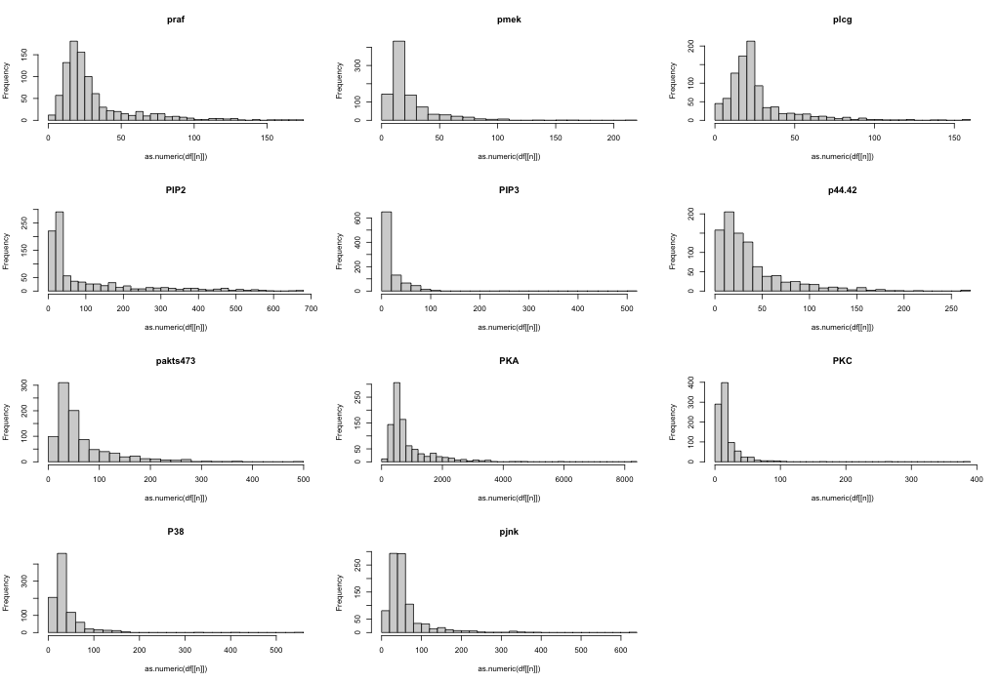
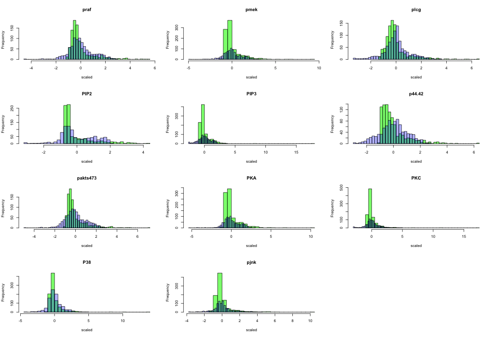
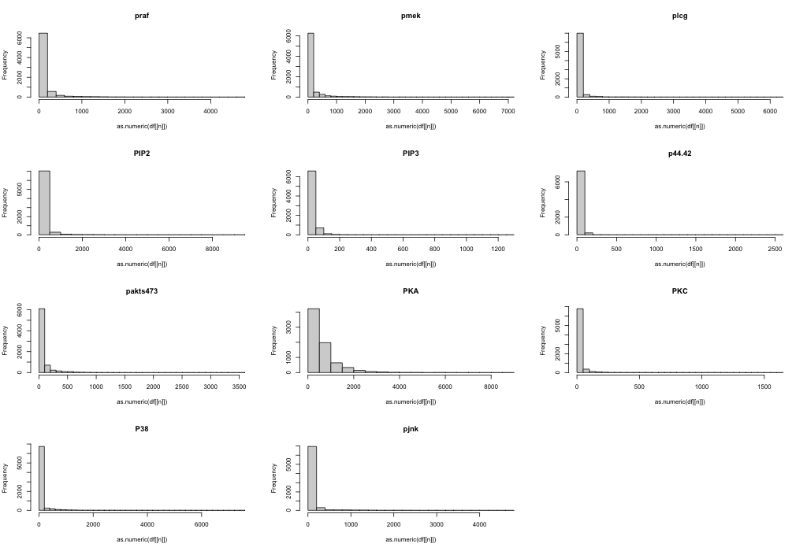
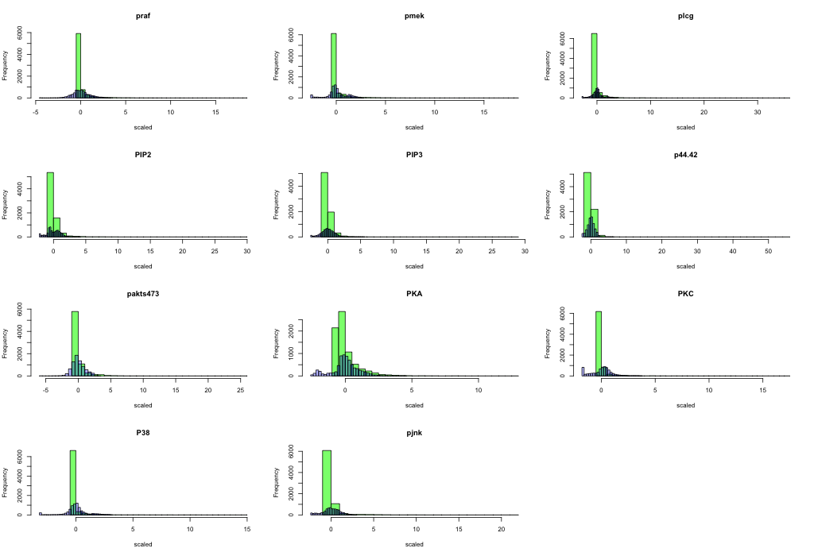

We have a sampling of $n$ independent observation from a gaussian *joint* distribution of dimension $p$. These data are stored into a matrix $\mathbb{X} \in \mathbb{R}^{n\times p}$.<br>

Given the matrix we want to get more clues about the unknown adiacency matrix that models the DAG of the joint distribution that has generated our observations.

This matrix is $\mathbb{A}$ and it's a lower triangular matrix that belongs to $\mathbb{R}^{p\times p}$ and it's such that it has a 0 in the position $(i,j)$ if $j \not\in pa(X_i)$ else the value represents the strength of the relationship that involves the two nodes.<br>

We know how to model our observation, we know what $\mathbb{A}$ means, but how can we link the distribution of the j-th random variable (remember that we have a p-dimensional random vector) to the matrix $\mathbb{A}$?<br>
Well we can say that the j-th random variable $X_j$ can be computed as follows:
\begin{equation}
  X_j = \sum_{k | k \neq j}\mathbb{A[j,k]\cdot X_k}+\epsilon_j
\end{equation}
The gaussian is in $\epsilon$, in fact $\epsilon_j \sim N_1(0, \sigma^2)$.

So we have a model that depends from two parameters that are $\mathbb{A}$ and $\sigma^2$. At this point we can proceed to the things that are of interest for us.

Since we can obtain the distributions of the X from our parameters, we want to discover our parameter starting from our observations, so the problem reduces to find $\theta = (\mathbb{A}, \sigma^2)$ starting from $\mathbb{X}$.

In order to do this we can use the log likelihood that's defined as follows:
\begin{equation}
  \mathcal{\ell}_n(\mathbb{A}, \sigma^2) \propto - \sum_{j=1}^p \left (\frac{1}{2\sigma^2} \sum_{i=1}^n \left( \mathbb{X}[i,j] - \sum_{k | k\neq j} \mathbb{A}[j,k]\cdot \mathbb{X}[i,k]\right)^2 + \frac{n}{2}ln\sigma^2 \right)
\end{equation}
Let's enroll it:
We have three sums that are, going from the inner to the outer:

* *inner*: $\sum_{k \in [1,p] \setminus j} \mathbb{A}[j,k]\cdot \mathbb{X}[i,k]$ where we are doing the dot product from the weight that has the eventual edge that goes from $k$ to $j$ (scalar) and the value of the k-th random variable ($X_k$) in the i-th sample, than we sum all these values. This can be seen as a kind of a weighted sum of the i-th sample where the weights are the influences that all the other random variables have over the k-th one. So it can be seen as a "how much j is influenced by the other variables in the sample $i$"
* *middle*: $\sum_{i=1}^n \left( \mathbb{X}[i,j] - \text{inner}\right )^2$ where for each of the i-th observation of the j-th random variable, we subtract the sum obtained in the inner that is a scalar, than we sum all these values. We are subtracting the value of the j-th random variable in the sample i with the influence that the other random variables have had on $j$, so we can see it as 'how much j is distant from the value that should have accordingly with the other variables', than we do the square of this difference. It can be interpretated as the euclidean distance from the vector of the n samples of j and the vector of the influences of all the other variables (the value that should have) over j.
* *outer*: $\sum_{j=1}^p \frac{\text{middle}}{2\sigma^2} + \frac{n}{2}ln\sigma^2$ We sums up the value obtained from all the $p$ random variables multiplicated and summed with constants that are dependent from $\sigma^2$

Let's see it in code:


```{r}

compute.middle = function(X, A, j, p){
  # Finding the indexes K = {k s.t. k is in [1,p]\j}
    K = which((1:p)!=j)
    # in k we have the indexes of the row without j
    
    inners = apply(X[, K] * A[j, K], 1, sum) # n length vector containing the inner sums for each i-th sample
    middle = sum((X[, j] - inners)^2)  # as a matter of fact in the middle we are working on the j-th column
    return(middle)
}

log_likelihood = function(X, A, sigma.square){
  n = dim(X)[1]
  p = dim(X)[2]
  return(-sum(sapply(1:p, function(j) (compute.middle(X,A,j,p)/(2*sigma.square)+(n/2*log(sigma.square))))))
}

```


Since MLEdag computes for us the estimate of the matrix $\mathbb{A}$ and the matrix $\mathbb{X}$ is what we have given that it's our observation, we can optimize the log likelihood in order to retrieve sigma, so it'll be the sigma.MLE

```{r}
sigma.MLE = function(X, A)
  return(
    optim(
      par=c(0.01),
      fn=function(sigma.sq)
        log_likelihood(X,A, sigma.sq),
      method=c("Brent"),
      lower = 0,
      upper = 10000,
            control = list(fnscale = -1)
    )
  )
```

According with [Chunlin Li Et. al](https://elearning.uniroma1.it/pluginfile.php/1112893/mod_assign/introattachment/0/Likelihood%20Ratio%20Tests%20for%20a%20Large%20Directed%20Acyclic%20Graph.pdf?forcedownload=1) we can also aproximate $\sigma^2$ with:
\begin{equation}
  \hat{\sigma}^2 = (np)^{-1} \sum_{j=1}^p \sum_{i=1}^n\left ( \mathbb{X}[i,j] - \sum_{k | k\neq j} \mathbb{A}[j,k]\cdot \mathbb{X}[i,k] \right ) ^2
\end{equation}

In code we have:

```{r}
sigma.estimator = function(X, A){
  n = dim(X)[1]
  p = dim(X)[2]
  return(sum(sapply(1:p, function(j)compute.middle(X,A,j, p)))/(n*p))
}

```

## Constrained Likelihood Ratio Test
Since we can now approximate sigma and $\mathbb{A}$ starting from $\mathbb{X}$, we can now run a constrained likelihood ratio test, in order to test the existence of directed links between specific nodes or directed pathways.<br>
The choice to reject the $H_0$ hypothesis in the two tests are made basing on one of these two values:

* $U_n$ for the **split** likelihood ratio
* $W_n$ for the **cross-fit** likelihood ratio

The main idea behind the computation of these two metrics is that when we want the **constrained version** of $\mathbb{A}$ we'll pass into the ```MLEdag``` function the observation matrix, a matrix $D$ that is the matrix representation of the set of linkages $F$ and is such that has 1 only in the coordinates $(i, j) \in F$ and some other numerical parameters. We'll compute over the entire observation the estimate of $\mathbb{A}$ with this function and we'll take the A.H0 result for the constrained version and A.H1 for the unconstrained one.<br>
Once we've the $\mathbb{A}$ matrices it's trivial to find the estimates for the $\sigma^2$ simply using the function ```sigma.estimator``` described above. In this specific case we'll compute these estimates over the training part of $\mathbb{X}$ for the **constrained version** and over the test part for the other one.<br>
At this point we've $\hat{\theta}_0^{tr}$ and $\hat{\theta}^{te}$ for compute the $U_n$ value and, conseguently, the $W_n$, but in both cases we'll use their *logarithmic version*.


We want to highlight that for the pathway test we need also to compute not only the $\theta$ that maximizes the likelihood but also we need to find the right value of sparsity that maximize it, so there will be one more step in the computation but the main idea is the same.

```{r}
inner_LRT_function.paths = function(X, X.tr, X.te, D){
   
  # Computing all the A.h0 over the sparsity parameters 'k'
  A.mles = lapply(1:sum(D), function(mu)MLEdag(X, D=D, tau=0.35, mu=mu, rho=1.2, trace_obj = F))
  #A.h0s = lapply(1:sum(D), function(mu)MLEdag(X.tr, D=D, tau=0.35, mu=mu, rho=1.2, trace_obj = F)$A.H0)
  A.h0s  = lapply(A.mles, function(a)a$A.H0)
  #A.h1s = lapply(1:sum(D), function(mu)MLEdag(X.te, D=D, tau=0.35, mu=mu, rho=1.2, trace_obj = F)$A.H1)
  A.h1s  = lapply(A.mles, function(a)a$A.H1)
  # For each A.h0 compute the associated sigma
  sigmas.0 = t(sapply(A.h0s, function(a)sigma.estimator(X.tr, a)))
  sigmas.1 = t(sapply(A.h1s, function(a)sigma.estimator(X.te, a)))
  # Computing the likelihoods of each pair (A.h0, sigma.h0)
  likelihoods.0 = t(sapply(1:length(sigmas.0), function(idx)log_likelihood(X.tr, A.h0s[[idx]], sigmas.0[idx])))
  likelihoods.1 = t(sapply(1:length(sigmas.1), function(idx)log_likelihood(X.tr, A.h1s[[idx]], sigmas.1[idx])))
  
  # Finding the idx that give us the maximum likelihood
  mle_idx.0 = which(likelihoods.0==max(likelihoods.0))[1] # maximum likelihood over h0
  mle_idx.1 = which(likelihoods.1==max(likelihoods.1))[1] # maximum likelihood over h0
  
  return (likelihoods.1[mle_idx.1]-likelihoods.0[mle_idx.0])
  #return(list(U.n=exp(log_likelihood(X.tr, A, sigma.unconstrained)-likelihoods[mle_idx]), A.h0=A.h0s[[mle_idx]]))
}

inner_LRT_function.links = function(X, X.tr, X.te, D){
  tmp = MLEdag(X = X, D = D, tau = 0.35, mu = 1, 
                    rho = 1.2, trace_obj = FALSE)
  A.h0 = tmp$A.H0
  A = tmp$A.H1
  
  sigma.h0 = sigma.estimator(X.tr, A.h0)
  sigma.unconstrained = sigma.estimator(X.te, A)
  
  return(log_likelihood(X.tr, A, sigma.unconstrained)-log_likelihood(X.tr, A.h0, sigma.h0))
}

log.LRT = function(X,D, links=T){
  n=dim(X)[1]
  X.tr = X[1:(n%/%2),]
  X.te = X[(n%/%2+1):n,]
  
  if(links){
    U_n = inner_LRT_function.links(X, X.tr, X.te, D)
    U_n.swap = inner_LRT_function.links(X, X.te, X.tr, D)
  }
  else{
    U_n = inner_LRT_function.paths(X, X.tr, X.te, D)
    U_n.swap = inner_LRT_function.paths(X, X.te, X.tr, D)
  }
  return(list(links = links, U_n = U_n, W_n = (log((exp(U_n)+exp(U_n.swap))/2))))
}

```

### Testing the functions
Since we have implemented the computation of these ratios we can now test whether a sample comes from a distribution that has a specific set of linkages (or directed pathway) and when it hasn't it. In order to test our implementation we've built two functions, one for the linkages problem and one for the path. In both cases we built a linkages matrix $D$ and we create an adjacency matrix $\mathbb{A}$ that is built in function of a parameter $h0$ that indicates if we want that $\mathbb{A} \in H_0$ or not. It takes also the value of $\alpha$ in order to execute the test. As anticipated we're working on the logarithmic version of $U_n$ and $W_n$ so we'll check whether they are lower than $-log(\alpha)$. We sums up the times that we reject the null hypothesis and if we pass h0=True we'll check the percentage of False discovery that is expected to be around the value of $alpha$ (actually it should be lower than it but since it's a new and experimental way to make this kind of tests, it's acceptable if we've not the perfection in our results.). We can also check the percentage of true negative passing h0=False.

```{r}
library(cli)
library(clrdag)
test_path = function(m=1e2,h0=T, alpha = .05){
  # matrices parameters
  p = 10
  n = 100
  sparsity = 2/p
  
  # Building the linkages set
  D.pathway = matrix(0, p,p)
  D.pathway[3, 4]=1
  D.pathway[4, 5]=1
  D.pathway[5, 6]=1
  D.pathway[6, 7]=1
  # Building A accordingly to h0
  A.pathway.hidden = matrix(rbinom(p*p,1,sparsity)*sign(runif(p*p,min=-1,max=1)),p,p)
  A.pathway.hidden[upper.tri(A.pathway.hidden, diag = T)] = 0
  A.pathway.hidden[4,3]=as.integer(!h0)
  A.pathway.hidden[5,4]=0
  A.pathway.hidden[6,5]=0
  A.pathway.hidden[7,6]=0
  
  # Running the actual test
  out_U = 0
  out_W = 0
  cli_progress_bar("Cleaning data", total = m)
  for(i in 1:m){
    X = matrix( rnorm(n*p), n, p) %*% t(solve(diag(p) - A.pathway.hidden) )
    LRT = log.LRT(X, D.pathway, links=F)
    if(LRT$links)
      cat('ERRORE, chiamata LRT con links=', links,'\n')
    out_U = out_U+(LRT$U_n>-log(alpha))
    out_W = out_W+(LRT$W_n>-log(alpha))
    cli_progress_update()
  }
  cli_progress_done()
  return(list(U_n = out_U/m, W_n = out_W/m))
}

test_link = function(m=1e3, alpha=.05, h0=T){
  # matrices parameters
  p = 10
  n= 100
  sparsity = 2/p
  
  # Building the linkages set
  D.link = matrix(0, p, p)
  D.link[2, 1] = 1
  D.link[6, 3] = 1
  D.link[10, 9] = 1
  # Building A accordingly to h0
  A.link.hidden = matrix(rbinom(p*p,1,sparsity)*sign(runif(p*p,min=-1,max=1)),p,p)
  A.link.hidden[upper.tri(A.link.hidden, diag = T)] = 0
  A.link.hidden[2, 1] = 1#as.integer(!h0)
  A.link.hidden[6, 3] = 1
  A.link.hidden[10, 9] =1
  
  # Running the actual test
  out_U = 0
  out_W = 0
  cli_progress_bar("Cleaning data", total = m)
  for(i in 1:m){
    X = matrix( rnorm(n*p), n, p) %*% t(solve(diag(p) - A.link.hidden) )
    LRT = log.LRT(X, D.link, links=T)
    if(!LRT$links)
      cat('ERRORE, chiamata LRT con links=', links,'\n')
    out_U = out_U+(LRT$U_n>-log(alpha))
    out_W = out_W+(LRT$W_n>-log(alpha))
    cli_progress_update()
  }
  cli_progress_done()
  return(list(U_n=out_U/m, W_n=out_W/m))
}
```


```{r}
set.seed(1234)
test_path(h0 = F)
```

```{r}
set.seed(1234)
test_link(h0 = F, m=1e2)
```

## PART 3

Now let's check the size $\alpha$  and the power $ 1- \beta $ of our procedure.

Starting from the size and noticing that the power is the proportion of rejections we get by applying our test on M dataset generated from a model *compatible* with H0,  we implemented the following simulation:
```{r}
### Parameters
set.seed(2018)
p <- 10
n <- 200
M <- 1000

### H0: F = { (p,2) }, and A[F] = 0
D <- matrix(0, p, p)
D[p,2] = 1

### Adjacency Matrix >> Hub
# All connected to 1, NO EDGE between p-2 >> **COMPATIBLE** with H0
A      <- matrix(0, p, p)     
A[, 1] <- sign( runif( p, min = -1, max = 1 ) )
A[1,1] <- 0

# Simulation --------------------------------------------------------------

M=1000
cont=0
alpha=0.05
contU=0
contW=0
U_n <- rep(NA, M)
W_n <- rep(NA, M)
for(i in 1:M) {
  X   <- matrix( rnorm(n*p), n, p) %*% t(solve(diag(p) - A) )
  temp=log.LRT(X,D, links=T,mu=1.2)
  U_n[i]=temp$U_n
  W_n[i]=temp$W_n
  
  if (U_n[i]>log(1/alpha)) contU=contU+1
  if (W_n[i]>log(1/alpha)) contW=contW+1
}

cat('alpha is equal to for U ', contU/M,'alpha is equal to for W',contW/M)

# 0.092 and 0.103
```
Our results are 0.092 for Un and 0.103 for Wn respectively.

Noticing that the power is the proportion of rejections we get by applying our test on M dataset generated from a model *NOT compatible* with H0,  we implemented the following simulation:
```{r}
#Beta= the probability of failing to reject the null hypothesis when the null 
# hypothesis is false
p=10
n=100
sparsity=2/p
### H0: F = { (p,1) }, and A[F] = 0
D <- matrix(0, p, p)
D[2:p,1]=1
D[3:p,2]=1

### Adjacency Matrix >> Hub
# All connected to 1, NO EDGE between p-2 >> **NOT COMPATIBLE** with H0
#A      <- matrix(0, p, p)     
#A[2:p, 1] <- sign( runif( p-1, min = -1, max = 1 ) )
set.seed(2018)
A=matrix(rbinom(p*p,1,sparsity)*sign(runif(p*p,min=-1,max=1)),p,p)
A[2,8]=1
A[5,6]=1
A[8,9]=1
A[2:p,1]=1
A[3:p,2]=1

# SIMULATION
contU=0
contW=0
alpha=0.05
M=1000
U_n <- rep(NA, M)
W_n <- rep(NA, M)
for(i in 1:M) {
  X   <- matrix( rnorm(n*p), n, p) %*% t(solve(diag(p) - A) )
  temp=log.LRT(X,D, links=T,mu=1.2)
  U_n[i]=temp$U_n
  W_n[i]=temp$W_n
  
  if (U_n[i]>log(1/alpha)) contU=contU+1
  if (W_n[i]>log(1/alpha)) contW=contW+1
}

cat('1-beta is equal to for U: ', contU/M,'   ,1-beta is equal to for W:',contW/M)
#1-beta is equal to for U:  0.969    ,1-beta is equal to for W: 0.991
```
 that produce as results 0.969 for Un and 0.991 for Wn respectively.
 

## PART 4

We found interesting to test the performance of our method for missed linkages so we decided to test the connection between PIP2->PKC. Even if all the missed linkages were very attractive, we decided to see the behaviour of the test under different conditions. For this reason, we opted for PKC->Jnk as second connection and PKC->PIP3 as third connection. In this way we could have a general overview of the performance.


We decided to test the chain PKC-Raf-Mek-Erk with the pathway-type test since it seems a pretty long chain in which PKC is involved as starting element and we have access to a dataset (pma.csv) in which there is a perturbation on PKC.

## PART 5
We are now using pma.csv to test our hypothesis, but before running any test, we need to check that our assumptions are correct: are our data effectively zero-mean Gaussian?

This is our starting point 

and we can simply understand that our data are all but noramlly distributed.
Just to be sure, we runned boxplots and Shapiro-tests that confirmed our hypothesis.

Our intention was then to modify the data in order to approximate a zero-mean Gaussian.
We tried different methodologies such as scale method, subtract the mean and divide by the standard deviation and box-cox. We opted for a combination of a box-cox transformation and scale method.
The box-cox transformation is implemented as:
\begin{equation}
y(\lambda)= 
\begin{cases}
    \frac{y^{\lambda}-1}{\lambda},& \text{if } \lambda \neq 0\\
    log(y),              & \text{if} \lambda = 0
\end{cases}
\end{equation} 
 
in code we have:
```{r}
boxcox.transform= function(data){
  bx = boxcox(data~1, plotit = F)
  lambda = bx$x[which(bx$y==max(bx$y))[1]]
  if(lambda != 0)
    return((data^lambda-1)/lambda)
  else
    return(log(data))
}
normalize = function(data)
  return(scale(boxcox.transform(data)))

```

After applying this transformation to our data, we ended out with this result: 
we can see green histograms after the process of scaling and soft blue histogram after the boxcox transformation.


This seems a good result starting from our data: in fact, they grafically appear normally distributed around 0.

### CONNECTION 1 PIP2->PKC # male *2 ( perchè il missed lo azzeccano?)

 We fixed a level alpha=0.05 so that we have $log(\frac{1}{\alpha})\simeq 1.30$. 
 The following table summarize our results.

k           pvalue_MLE_dag    log(Un)               log(Wn)
--------   --------------   ---------------- ----------------
0.01       0.0349             -11.13            -10.02
0.1        0.0349             -11.13            -10.02
1          0.0349             -11.13            -10.02
10         0.0349             -11.13            -10.02
100        0.0349             -12.04            -10.84
---------  --------------   ---------------- ----------------

We can see that there aren't many variations as the parameter k varies as first result.
But let's analyze our results: in this specific case ( we fixed an alpha level and a specific dataset where there is a perturbation on PKC ), MLE_dag rejected  the null hypothesis correctly while we cannot reject the null hypothesis.

### SECOND CONNECTION: PKC->Jnk  # C'é #bene

k           pvalue_MLE_dag    log(Un)               log(Wn)
--------   --------------   ---------------- ----------------
0.01       5.21e-10            20.38              19.69
0.1        5.21e-10            22.7               22.01
1          5.21e-10            22.7               22.01
10         5.21e-10            22.7               22.01
100        6.07e-10            23.27              22.57
---------  --------------   ---------------- ----------------

Also in this example, the k parameter did influenced in a strong way the result.
MLE_dag rejected correctly the null hypothesis and so did we.

### THIRD  CONNECTION: PKC->PIP3 # Non c'è #bene

k           pvalue_MLE_dag    log(Un)               log(Wn)
--------   --------------   ---------------- ----------------
0.01       0.65               -12.61              -11.80
0.1        0.65               -12.61              -11.80
1          0.65               -12.61              -11.80
10         0.65               -12.61              -11.80
100        0.64               -13.99              -13.09
---------  --------------   ---------------- ----------------

In this case, MLE_dag accepted the null hypothesis correctly and we did the same.
In addition, this is the only situation in which we found a sufficient deviation in our statistics 
and it should be interesting to see it grafically.


#PATHWAY LINKAGE: PKC->(RAF;MEK,ERK) #male

k           pvalue_MLE_dag    log(Un)               log(Wn)
--------   --------------   ---------------- ----------------
0.01       2.9e-96            -71.65              -55.68
0.1        2.9e-96            -71.65              -55.68
1          2.9e-96            -71.65              -55.68
10         2.9e-96            -71.65              -55.68
100        6.2e-100           -71.65              -55.68
---------  --------------   ---------------- ----------------

MLE_dag method reject the null hypothesis correctly while we cannot reject the null hypothesis.


Summing up, MLE_dag has a good performance on this dataset while we have some difficulties in rejecting the null hypothesis.

## POINT 6
Now let's move on the entire dataset obtained concatenating all the data.
As before, we can visually check our zero-mean Gaussian aasumption.

This is our starting point 

and after our transformation (box-cox and scale ), we have 

As before, we can say that we achieved a good result with respect to our assumption.
It's interesting to compare the results of our test on a different dataset in which we find different kind of perturbations.

We fixed a level alpha=0.05 so that we have $ log(\frac{1}{\alpha})\simeq1.30 $.
The following table summarize our results.
 
### CONNECTION 1 PIP2->PKC # male *2

 We fixed a level alpha=0.05 so that we have $log(\frac{1}{\alpha})\simeq1.30$.
 The following table summarize our results.

k           pvalue_MLE_dag    log(Un)               log(Wn)
--------   --------------   ---------------- ----------------
0.01          1.67e-113           -883               -Inf
0.1           1.67e-113           -883               -Inf
1             1.67e-113           -883               -Inf
10            1.67e-113           -883               -Inf
100           1.67e-113           -883               -Inf
---------  --------------   ---------------- ----------------

They reject correctly the null hypothesis ( but they said it was a missed link even if the take it correctly all the times) while we can not reject the null hypothesis

### SECOND CONNECTION: PKC->Jnk  # C'é  #male

k           pvalue_MLE_dag    log(Un)               log(Wn)
--------   --------------   ---------------- ----------------
0.01       0                  -466.16            -466.86
0.1        0                  -466.16            -466.86
1          0                  -466.16            -466.86
10         0                  -466.16            -466.86
100        0                  -751.49            -Inf
---------  --------------   ---------------- ----------------

They reject the null hypothesis (correctly) and we did not reject the null hypothesis

### THIRD  CONNECTION: PKC->PIP3 # Non c'è #bene*2

k           pvalue_MLE_dag    log(Un)               log(Wn)
--------   --------------   ---------------- ----------------
0.01       3.37e-30           -1342.46            -Inf
0.1        3.37e-30           -1342.46            -Inf
1          3.37e-30           -1342.46            -Inf
10         3.37e-30           -1342.46            -Inf
100        1.81e-29           -1679.78            -Inf
---------  --------------   ---------------- ----------------

They reject the null hypothesis (uncorrect), while we correctly accept the null hypothesis

#PATHWAY LINKAGE: PKC->(RAF;MEK,ERK) #male*2

k           pvalue_MLE_dag    log(Un)               log(Wn)
--------   --------------   ---------------- ----------------
0.01       0                  -1115.38            -Inf
0.1        0                  -1115.38            -Inf
1          0                  -1115.38            -Inf
10         0                  -1115.38            -Inf
100        0                  -1115.38            -Inf
---------  --------------   ---------------- ----------------

They reject the null hypothesis (correctly) but we can not reject the null hypothesis
